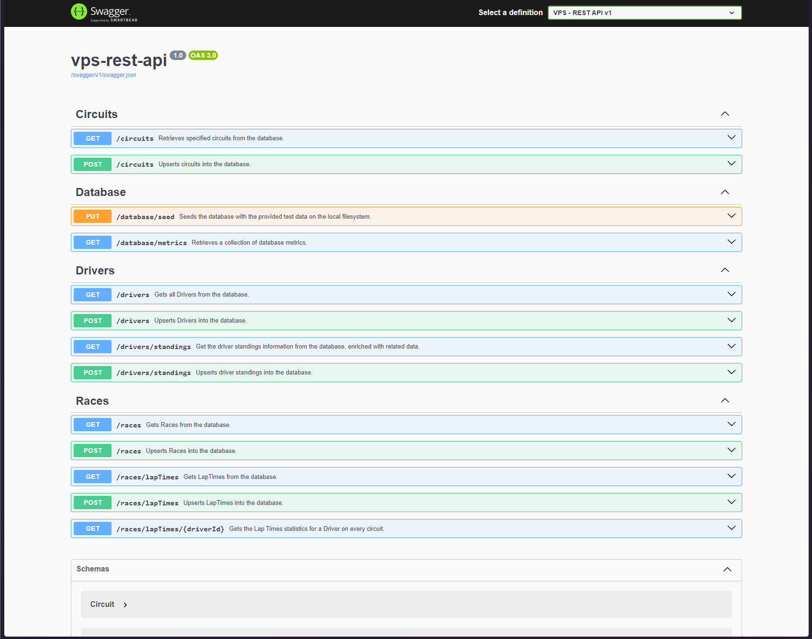

# Vehicle Performance Software Skills Challenge - Rest API

This .NET 8 api is responsible for parsing JSON files, storing the parsed data in a database and then exposing the data through a RESTful API. It allows clients to query, filter, and aggregate data.

## Development Environment

### Development Environment Setup

To set up your development environment for working on this project, you will need:

1. **.NET 8 SDK**: Ensure you have the .NET 8 SDK installed on your machine.
2. **SQLite**: The project uses SQLite as the development database. No separate installation is required as SQLite is embedded within the application through Entity Framework Core.
3. **Visual Studio Code**: While you can use any IDE or text editor, Visual Studio Code is recommended as the launch files have been preconfigured to speed up testing.

### Database

The database should be automatically created and migrations applied by the `startup.cs` file.

#### Seeding

To seed the necessary data for local debugging, you need to create a `dataset` folder in the root of your project directory. 
Inside the `dataset` folder, you should include the following JSON files: 
- `circuits.json`
- `driver_standings.json`
- `drivers.json`
- `lap_times.json`
- `races.json`

These files should contain the data provided in the challenge description. 

### Running the Project Locally

1. **Clone the repository** to your local machine.
2. **Navigate to the project directory** where the `VehiclePerformanceSoftware.sln` file is located.
3. **Run in VS Code:** you can start the application using the `F5` Key or the Debug button.
4. **Seed the database** (if necessary on first run) after placing the `dataset` files as described above. Navigate to the Swagger UI at `http://localhost:5000/`. Locate the `GET` request for `/database/seed` and Execute it. This will take a couple of seconds as it Parses and stores the data from the JSON files into our fresh database.

### Accessing the API Documentation

Once the application is running, you can access the Swagger UI to test the API endpoints and view the API documentation by navigating to `http://localhost:5000/` in your web browser.

## Unit and Integrations Tests

In the interest of time, I opted to build functionality to solve the requirements as opposed to invest time in writing tests.
While this is not best practice, I was sticking to the project description of not spending more than a couple of hours on the tasks.

#### What Unit Tests should be

Unit testing would live in a new project: `src/vps-rest-api.UnitTests`. 

Unit tests are designed to test individual units of code, such as methods or functions, in isolation. They help ensure that each unit of code behaves as expected and performs its intended functionality. By writing a test per service, we can thoroughly test the behavior and functionality of each service in our project.

To isolate dependencies, we can use either an `InMemoryDatabase` or `Moq`. 
An `InMemoryDatabase` would allow us to create a lightweight database that mimics the behavior of a real database.

On the other hand, `Moq` is a mocking framework that allows us to create mock objects for our dependencies. These mock objects simulate the behavior of the real dependencies, allowing us to test our services in isolation without relying on the actual implementation of the dependencies. This would require changes to create virtual Services and manipulate how the database is used.

#### What Integration Tests should be

Integration testing would live in a new project: `src/vps-rest-api.IntegrationTests`. 

Integration tests are closer to an end to end test of the API, as opposed to individual components. We would use a framework that allows us to query the REST API endpoints with sample data.

Unlike unit tests, integration tests should use a real `sandpit` database instead of an in-memory database. This ensures that the tests accurately reflect the behavior of the system in a production-like environment.
It is thus important to clean up any test data or resources created during the test execution. This ensures that each test starts with a clean state and avoids interference between test cases. As well as not leaving test data in the database.
